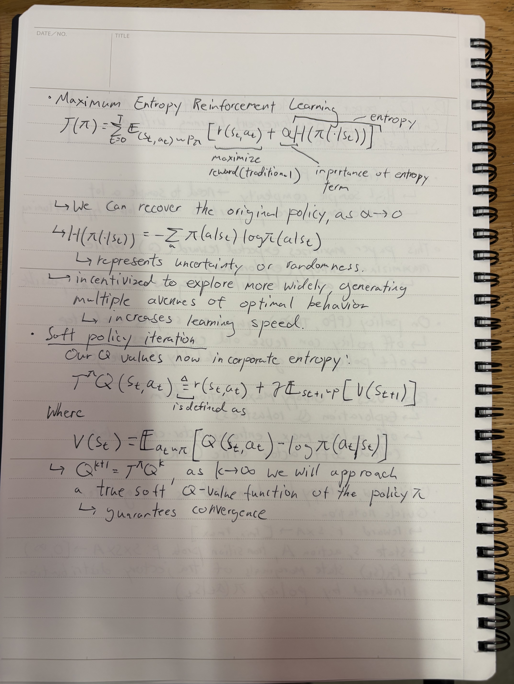

### **Day 12**

- **PAPER: Soft Actor-Critic: Off-Policy Maximum Entropy Deep Reinforcement Learning with a STochastic Actor Pt 1**
  - Struggles with model free deep RL
  - Entropy maximization term
  - Maximum Entropy Reinforcement Learning
  - Soft policy iteration
- **Paper Implementation: PPO pt 5**
  - Started configuring the cartpole environment NVIDIA Omniverse
  - PPO Code located in [here](../code/models/ppo.py)
  - cartpole environment located in [here](../code/environment/cartPole.py)
  - Things left: Environment configuration, Actor Parallel, minibatch updates

### **Notes**

  
  

 

  

