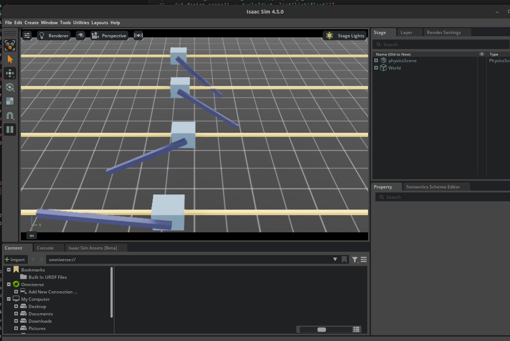

### **Day 13**

- **Paper Implementation: PPO pt 5 / Omniverse Development pt 2**
  - Started configuring the cartpole environment NVIDIA Omniverse
  - Got to put actions into cartpoles, now I just need to get a manager configured environment
  - PPO Code located in [here](../code/models/ppo.py)
  - cartpole environment located in [here](../code/environment/cartPole.py)

### **Notes**

  

 
