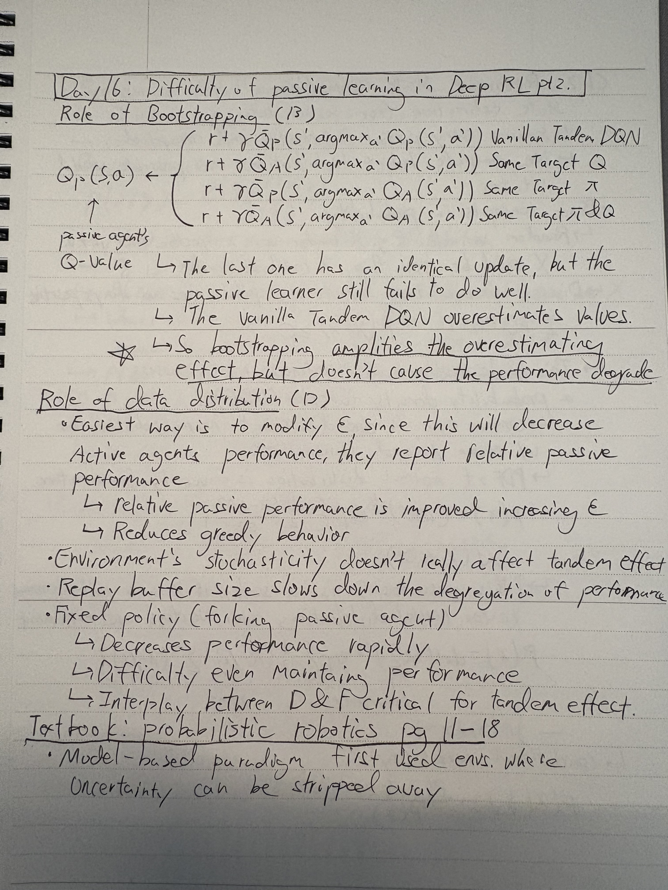

### **Day 16**

- **PAPER: The Difficulty of Passive Learning in Deep Reinforcement Learning pt 2**
  - Really cool paper
  - Role of bootstrapping in passive learning
  - Role of data distribution in passive learning
- **BOOK: Probabilistic Robotics**
  - Probability
    - multivariate gaussian distribution
    - Bayes rule, etc.

### **Notes**

  
  

 

  

