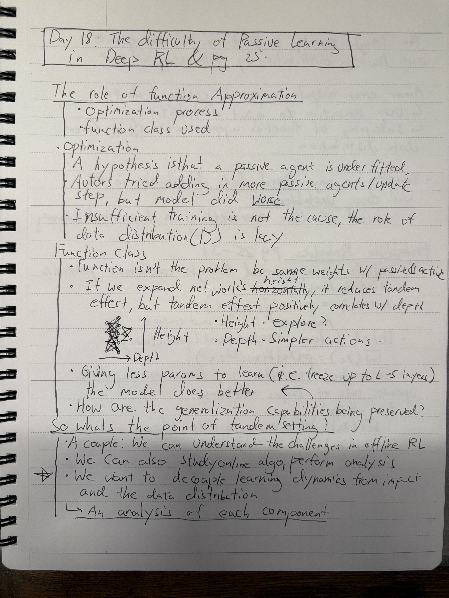
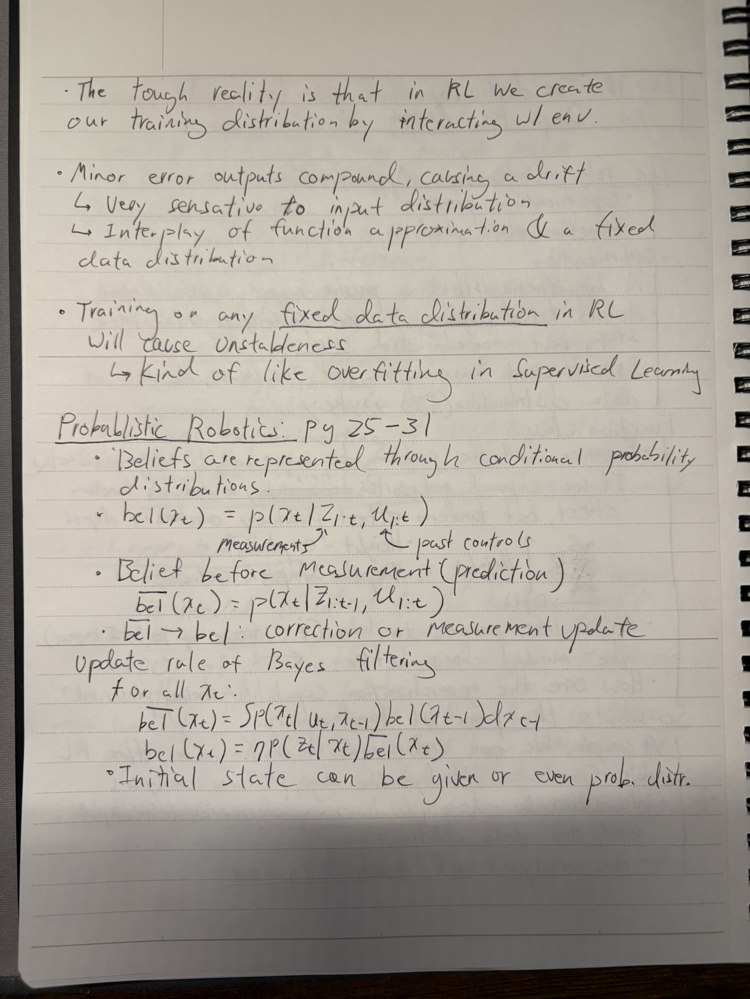

### **Day 18**

- **PAPER: The Difficulty of Passive Learning in Deep Reinforcement Learning pt 4**
  - Role of function approximation
  - Role of optimization process and function class
  - Practical usage of tandem learning
  - Training a RL model on a fixed data distribution will always cause unstableness
- **BOOK: Probabilistic Robotics**
  - Belief distributions
  - Bayes filtering

### **Notes**

  
  

 

