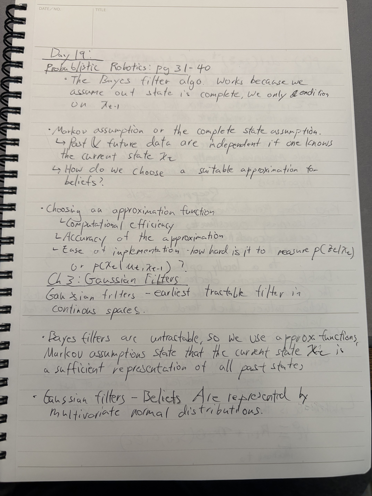
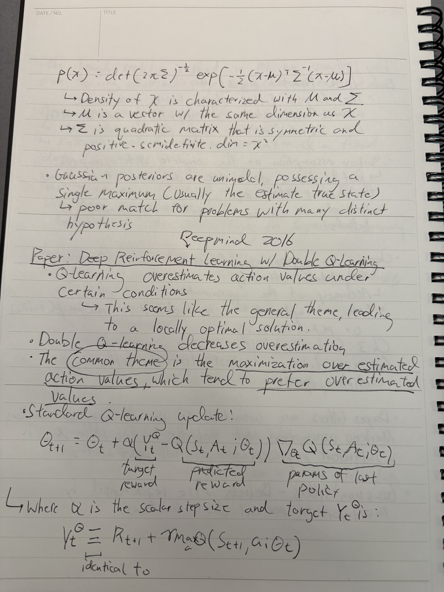
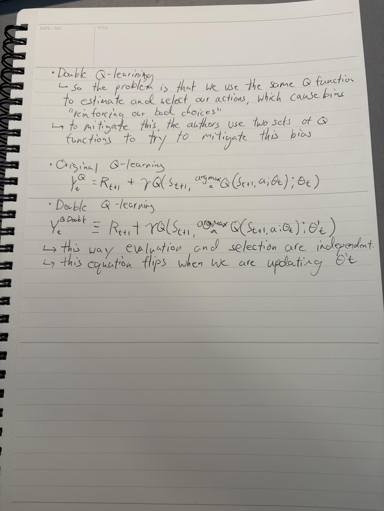

### **Day 19**

- **PAPER: Deep Reinforcement Learning with Double Q-Learning Pt.1**
  - Double Q-Learning
- **BOOK: Probabilistic Robotics**
  - Bayes Filter
  - Markov Assumption
  - Gaussian Filters

### **Notes**

  
  

 

  

