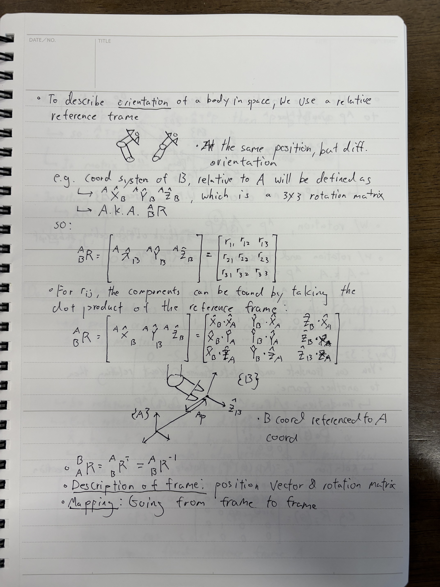
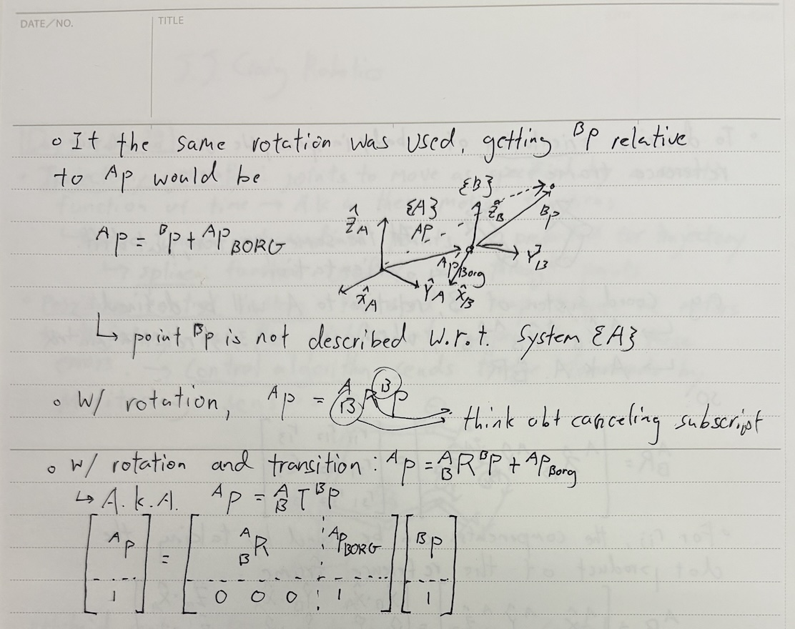

### **Day 2**

- **Basic Robotic Definitions**
  - Trajectory Generation
  - Position Control System
  - Hybrid Control
  - Relative Reference Frames
  - Description of Frame
  - Mapping
- **Notation**
  - Position Vector in Coord Systems
  - Rotation Matrix
  - Transition Matrix

### **Textbook Notes**

  
  

 

  

