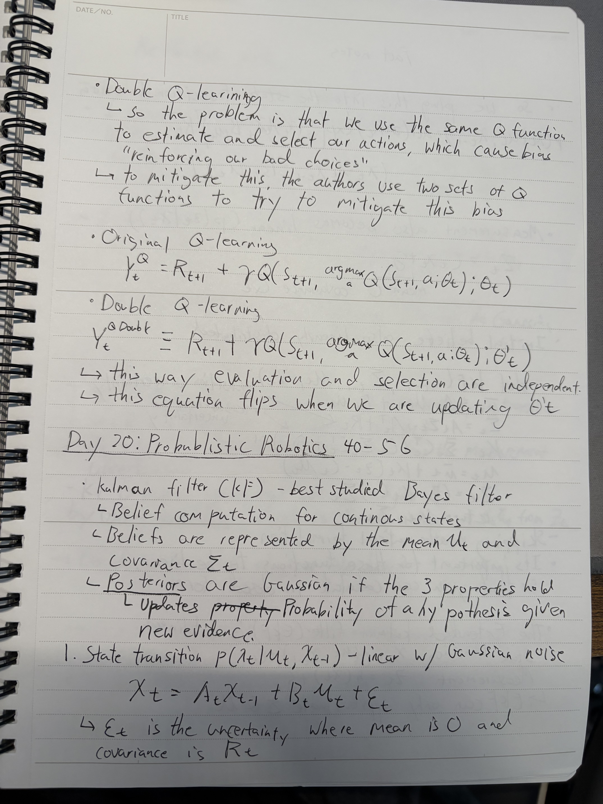
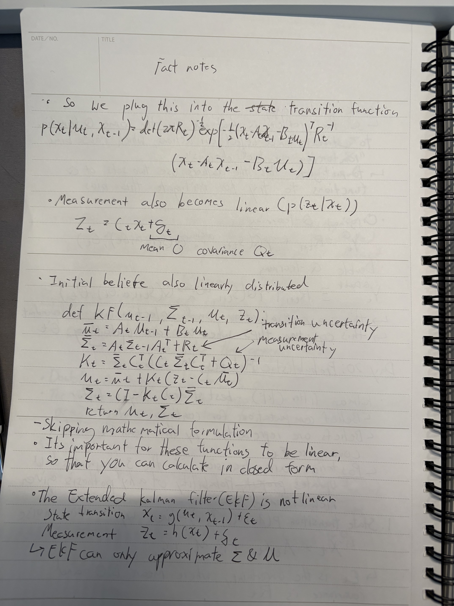
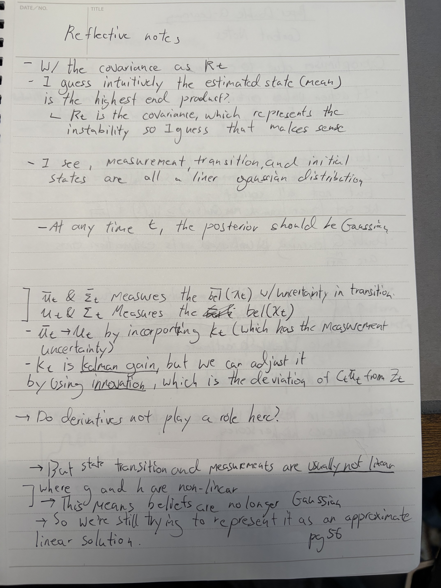
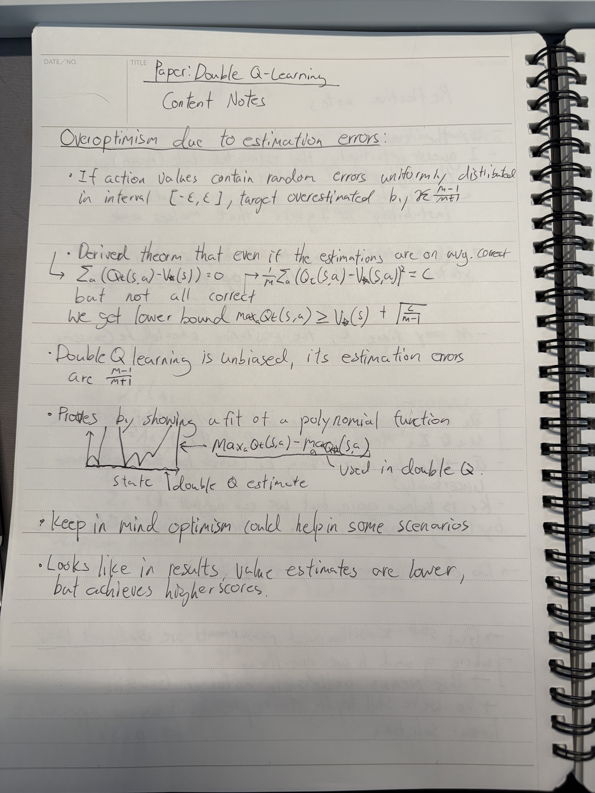
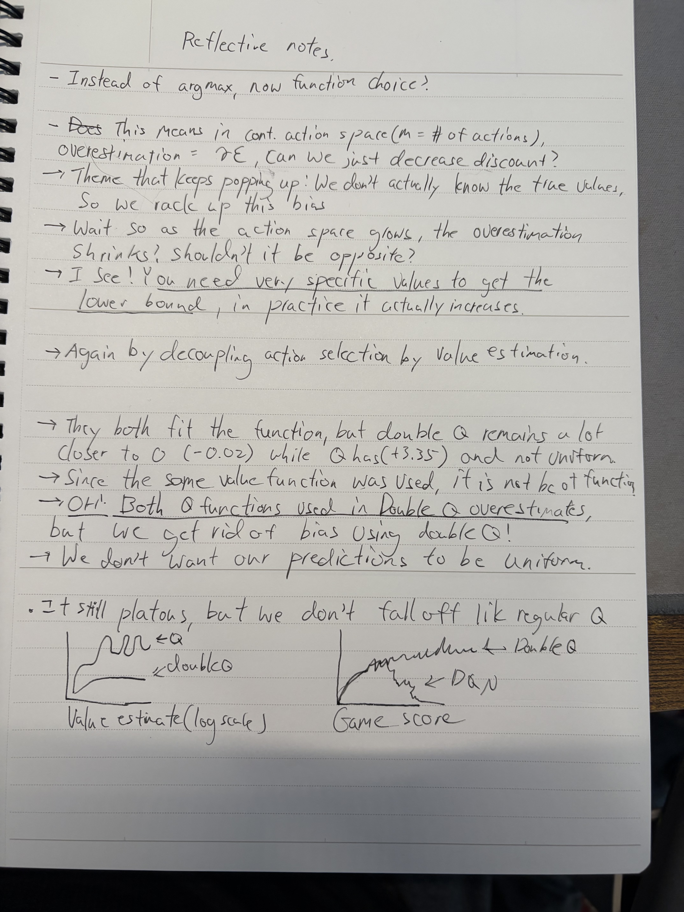

### **Day 20**

- **Changing Notetaking Style**
  - Left side will reflect the facts I learn (content notes)
  - Right side will reflect the thoughts, ideas, reflections (reflective notes)
- **PAPER: Deep Reinforcement Learning with Double Q-Learning Pt.2**
  - Overoptimism due to estimation errors
  - Results vs DQN
  - Lower bound theory in Double Q
- **BOOK: Probabilistic Robotics**
  - Kalman filters
  - Measuring uncertainty in belief distributions
  - Extended Kalman filter

### **Notes**

  

 

  
  

 

  
  

