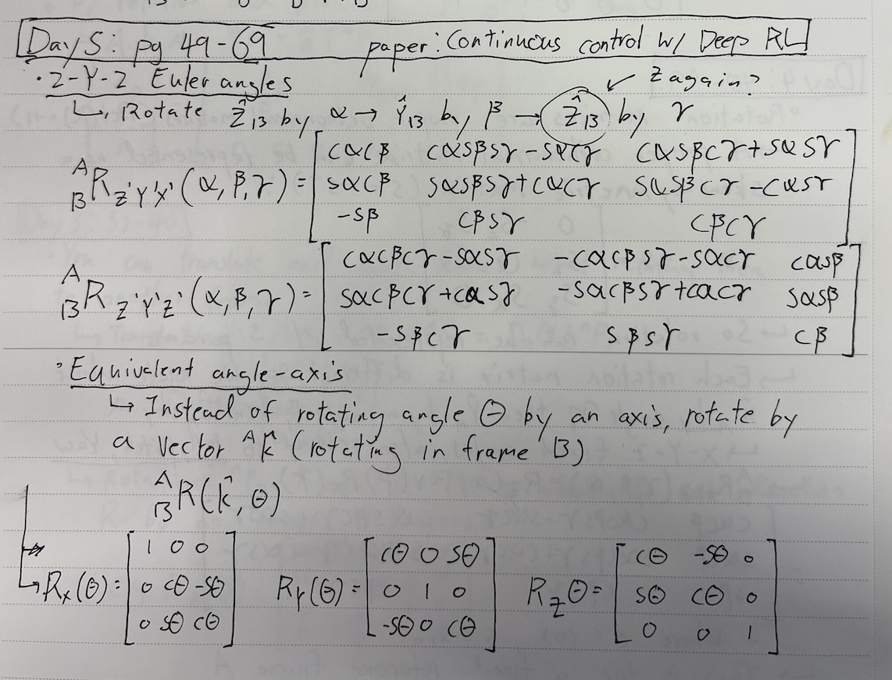

### **Day 5**

Big day!!

- **Rotation Matrices Continued**
  - Z - Y - Z Euler Angles
  - Equivalent angle-axis
  - General definition of rotating about an axis
- **Notation**
  - Equality vs. Equivalence
  - Free vs Line vector
  - Manipulator
- **In Practice**
  - Computational considerations
- **PAPER: Continuous Control with Deep Reinforcement Learning**
  - Background & Notation
  - Return Values
  - Critic function, Actor function, Replay Buffer, Stability in Training
  - **Algo**: Init status -> Sample action based on Actor -> Execute action, observe state and reward -> store state, action, reward, new state in buffer -> Estimate the reward using the Critic -> Update critic function from the actual reward -> Update the actor function from the critic -> stability weight update

### **Paper Notes**

  
  

 

  

 

### **Textbook Notes**

  

