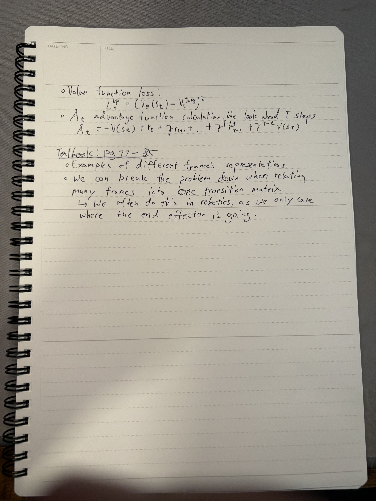

### **Day 7**

- **PAPER: Proximal Policy Algorithm - Part 2**
  - Adaptive KL Penalty Coefficient
  - Loss Function
  - Value Function loss
  - Advantage Function Calculation
- **Relating frames to each other**
  - Different examples
  - Breaking the problem down in robotics

### **Notes**

  
  

 
